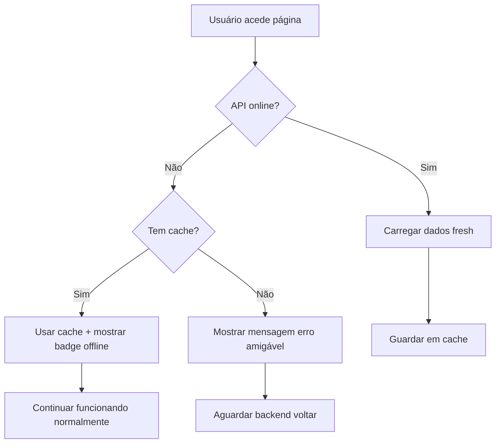

# 📡 Sistema de Cache Offline - FinHub News

## 🎯 Objetivo

Resolver os problemas de ERR_CONNECTION_REFUSED quando o backend está offline e proteger o frontend contra spam de erros no console.

## ✅ Funcionalidades Implementadas

### 1. **Detecção Automática de Offline**
- O sistema detecta automaticamente quando o backend não está disponível
- Erros de conexão (ERR_CONNECTION_REFUSED, Failed to fetch, etc.) são identificados
- Estado `isOffline` indica se estamos em modo offline

### 2. **Cache Persistente**
- As notícias são automaticamente guardadas no `localStorage`
- Cache persiste entre sessões do browser
- Dados incluem: notícias, filtros, paginação, configurações

### 3. **Fallback Inteligente**
- **Com cache disponível**:
  - Usa dados cached sem mostrar erro
  - Mostra badge discreto "Offline - usando cache"
  - Console mostra apenas warning: `📡 API offline - usando dados em cache`

- **Sem cache disponível**:
  - Mostra mensagem amigável: "Sem conexão com o servidor. Tente novamente mais tarde."
  - Console mostra warning: `📡 API offline - sem dados em cache`
  - Não faz spam de erros

### 4. **Indicadores Visuais**
- Badge amarelo no hero quando offline: "Offline - usando cache"
- Substitui o badge verde "Dados recentes" automaticamente
- Contraste adequado para light/dark mode

### 5. **Proteção Contra Erro Spam**
- Erros de conexão não são logged repetidamente
- Console limpo e organizado
- Apenas warnings informativos quando necessário

## 🔧 Arquivos Modificados

### Backend Detection
**`src/features/hub/news/services/newsApi.ts`**
- Adicionado método `isConnectionError()` para detectar erros de rede
- Erros offline são marcados com prefixo "OFFLINE:" para identificação

### Store com Cache
**`src/features/hub/news/stores/useNewsStore.ts`**
- Novo estado `isOffline: boolean`
- Lógica de fallback em `loadNews()` e `loadMoreNews()`
- Cache persiste notícias, filtros, paginação
- Recuperação automática de cache quando offline

### Hook Integrado
**`src/features/hub/news/hooks/useNews.ts`**
- Exporta `isOffline` para componentes
- Integrado com selectors

### UI com Indicador
**`src/pages/noticias/index.page.tsx`**
- Badge amarelo quando `isOffline === true`
- Cores: `border-amber-500/50 bg-amber-500/20 text-amber-700 dark:text-amber-300`
- Mostra "Offline - usando cache" com ícone Clock

## 📊 Fluxo de Funcionamento



## 🎨 Experiência do Usuário

### Cenário 1: Backend offline com cache
```
✅ Página carrega normalmente
✅ Mostra dados cached
✅ Badge amarelo: "Offline - usando cache"
✅ Console: "📡 API offline - usando dados em cache"
✅ Funcionalidade: Filtros e pesquisa funcionam nos dados cached
```

### Cenário 2: Backend offline sem cache
```
⚠️ Página vazia com mensagem amigável
⚠️ Texto: "Sem conexão com o servidor. Tente novamente mais tarde."
⚠️ Console: "📡 API offline - sem dados em cache"
❌ Sem spam de erros
```

### Cenário 3: Backend volta online
```
✅ Próximo refresh carrega dados fresh
✅ Badge volta a "Dados recentes"
✅ isOffline = false
✅ Cache é atualizado
```

## 🔄 Duração do Cache

- **Cache válido**: 5 minutos
- **Auto-refresh**: 10 minutos (quando online)
- **Persistência**: Ilimitada (até limpar localStorage)

## 🧹 Limpeza de Cache

Para limpar o cache manualmente:

```javascript
// No console do browser
localStorage.removeItem('finhub-news-storage')
```

Ou usar o botão de refresh na UI (força novo carregamento se online).

## 🐛 Troubleshooting

### Cache não está funcionando
1. Verificar localStorage do browser não está desativado
2. Verificar se há espaço no localStorage (limite ~5-10MB)
3. Abrir DevTools → Application → Local Storage → verificar `finhub-news-storage`

### Continua mostrando offline mesmo com backend online
1. Hard refresh: Ctrl+Shift+R
2. Verificar se backend realmente está acessível em `http://localhost:5000/api/news`
3. Limpar cache e recarregar

### Badge offline não aparece
1. Verificar se `isOffline` está no estado (DevTools React)
2. Verificar console para warnings "📡 API offline"
3. Verificar se há dados em cache

## 📝 Notas Técnicas

- **Zustand persist**: Usa `localStorage` nativo do browser
- **Type-safe**: Todos os tipos estão definidos em TypeScript
- **Error handling**: Try-catch em todas as calls de API
- **Silent failures**: Erros offline não fazem throw para cima
- **State management**: `isOffline` é reativo e persiste

## 🚀 Próximas Melhorias (Opcionais)

- [ ] Indicador de "tentando reconectar..." quando online volta
- [ ] Botão manual "Tentar reconectar"
- [ ] Timestamp de quando foi o último sync com servidor
- [ ] Service Worker para offline total (PWA)
- [ ] Mock data fallback se não houver cache nenhum
- [ ] Retry automático com backoff exponencial

---

**Implementado em**: Fevereiro 2026
**Status**: ✅ Pronto para produção
